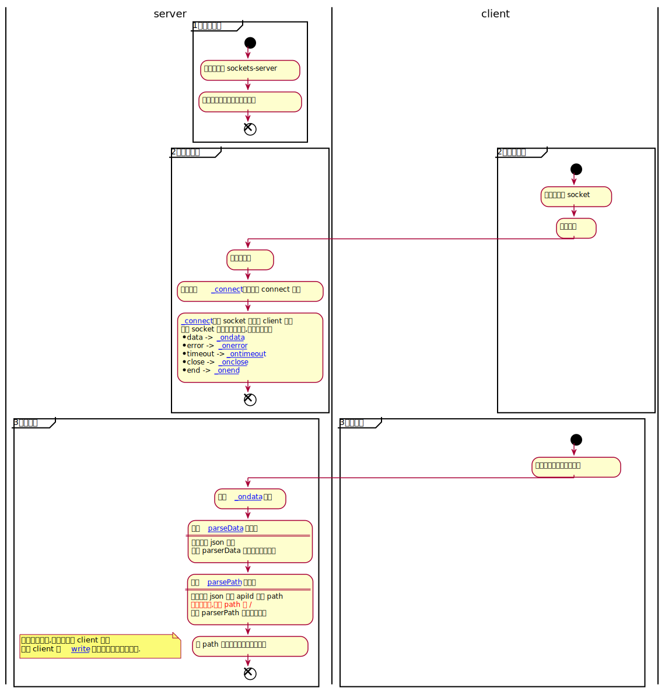

sockets-server
===

**通用 sockets server 框架**

## 概述
基于 express 中间件原理实现通用 socket server.
支持如下功能.

* 客户端会话管理
* 自定义路由解析
* 自定义包解析
* 自定义中间件扩展
...

## 快速入门
1. 安装包
    ```bash
    npm install sockets-server
    ```
2. 在项目根目录创建 `demo.js`
复制 [demo.js](https://github.com/zenHeart/sockets-server/blob/develop/examples/demo.js)
到 `demo.js`


3. 在 `package.json` 的 `scripts` 属性中添加如下内容
    ```json
       {
         "demo": "export DEBUG='socket:*';node demo.js"
       }
    ```

4. 安装 debug 包
    ```bash
    npm run debug 
    ```

5. 运行范例脚本 
    ```bash
    npm run demo
    ```


该 demo 模拟了 socket 客户端和服务端的通信.
效果如下图:


## 原理说明



